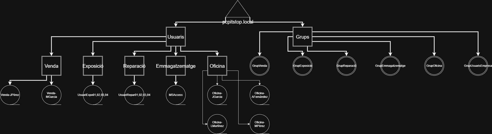

# pcpitstop-it-infrastructure
Final SMR project: complete IT infrastructure for a simulated company using Windows Server, Ubuntu, Active Directory, DNS, DHCP, pfSense, RAID, backups and network services.

# PCPitStop — IT Infrastructure

Final project developed during the **Microcomputer Systems and Networks (SMR)** program at INS Sa Palomera.

The project consists of the design and planning of a complete IT infrastructure for a simulated computer repair and retail company.

## 🏗️ Infrastructure

- Windows Server 2019 and Ubuntu Server
- Active Directory
- DNS and DHCP
- LAN and DMZ network segmentation
- File and print services
- Web and mail services
- pfSense firewall
- RAID and backup strategies
- Physical and logical security

## 🌐 Network

| Network | Address | CIDR | Hosts |
|---|---|---:|---:|
| LAN | `172.16.1.0` | `/27` | 30 |
| DMZ | `172.16.0.0` | `/29` | 6 |

## 🛠️ Technologies

`Windows Server` · `Ubuntu` · `Active Directory` · `DNS` · `DHCP` · `pfSense` · `RAID` · `Apache` · `Cisco Packet Tracer`

## 📁 Repository Content

- `diagrams/` — logical network diagrams and Packet Tracer topology
- `project-files/` — original project documentation, planning and supporting files

## 🎯 Key Skills

`Systems Administration` · `Networking` · `Security` · `Server Management` · `Backup & Recovery` · `Infrastructure Planning`

## 👤 Author

**Eric Guerrero**

[GitHub](https://github.com/eric-guerrero-it) · [Email](mailto:egm23f05@gmail.com)
